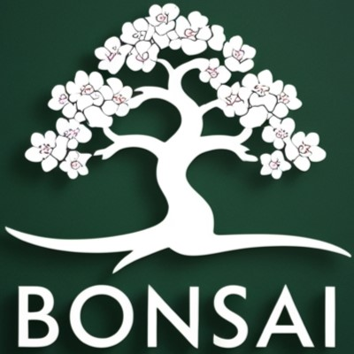
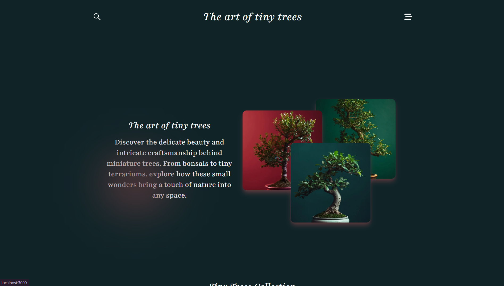

# 🌳 Tiny Trees - The Art of Tiny Trees

Welcome to **Tiny Trees**, an exciting journey through the world of bonsai. Here we explore the delicate and wonderful practice of cultivating miniature trees, transforming spaces into serene landscapes.

## 🚀 Features

- **Attractive Interface**: Designed with love and attention to detail.
- **Stunning Animations**: Implemented using **Framer Motion**, providing a smooth and dynamic user experience.
- **Interactive Content**: Learn and explore through interactive sections that make the experience more engaging.

## 🌱 Technologies Used

- **Next.js**: A powerful framework for React that allows us to create fast and efficient web applications.
- **Framer Motion**: An animation library for React, making it easy to create fluid and complex animations.

## 🎨 Example Usage

Some of the most interesting sections of **Tiny Trees** include:

- **Enhanced Bonsai Care Tips**: Practical advice to keep your bonsai healthy and happy.
- **Virtual Tour of Bonsai Gardens**: An immersive experience that takes you to some of the most stunning bonsai gardens around the world.

### Screenshot

